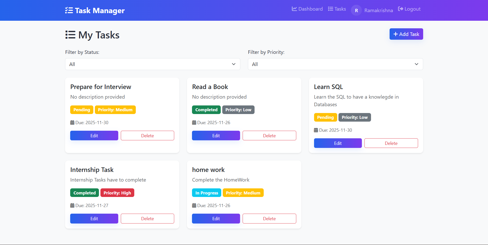
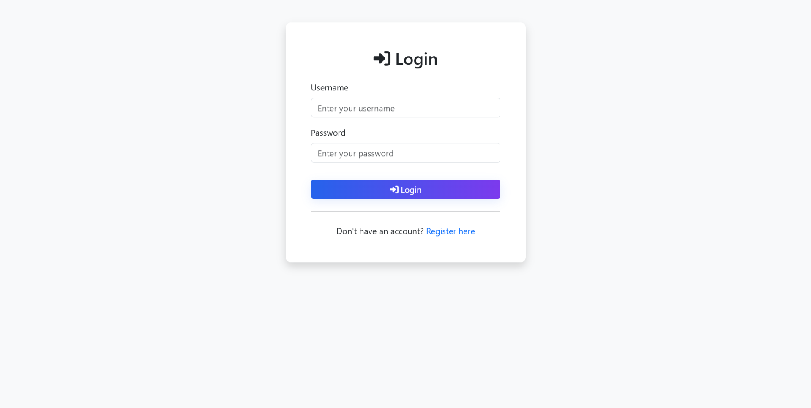

# 📝 Task Management System

A professional, full-stack web application for managing tasks efficiently. Built with Flask, MySQL, and Bootstrap 5.


## 🚀 Features

- ✅ **User Authentication** - Secure registration and login with encrypted passwords
- ✅ **Dashboard** - Visual statistics showing task overview
- ✅ **Task Management** - Full CRUD operations (Create, Read, Update, Delete)
- ✅ **Task Filtering** - Filter tasks by status and priority
- ✅ **Priority System** - Organize tasks with Low, Medium, and High priorities
- ✅ **Status Tracking** - Track tasks as Pending, In Progress, or Completed
- ✅ **Due Dates** - Set and monitor task deadlines
- ✅ **Responsive Design** - Works seamlessly on desktop, tablet, and mobile devices
- ✅ **Clean UI/UX** - Modern interface with Bootstrap 5 and Font Awesome icons

## 📸 Screenshots

### Dashboard


### Tasks Management


### Login Page


## 🛠️ Technologies Used

### Backend
- **Python 3.7+**
- **Flask 3.0** - Web framework
- **Flask-MySQLdb** - MySQL database integration
- **Flask-Bcrypt** - Password hashing and security
- **Python-dotenv** - Environment variable management

### Frontend
- **HTML5** - Semantic markup
- **CSS3** - Custom styling
- **Bootstrap 5** - Responsive framework
- **JavaScript** - Interactive functionality
- **Font Awesome** - Icon library

### Database
- **MySQL 8.0+** - Relational database

## 📋 Prerequisites

Before you begin, ensure you have the following installed:

- Python 3.7 or higher
- MySQL Server 8.0 or higher
- pip (Python package manager)
- Git (for cloning the repository)

## 💻 Usage

### 1. Register a New Account
- Click on "Register here"
- Fill in username, email, and password
- Click "Register"

### 2. Login
- Enter your username and password
- Click "Login"

### 3. Dashboard
- View statistics of your tasks
- See total, pending, in-progress, and completed tasks

### 4. Manage Tasks
- Click "Manage Tasks" or "Tasks" in navbar
- Click "Add Task" to create a new task
- Edit tasks by clicking the edit button
- Delete tasks by clicking the delete button
- Filter tasks by status and priority

### 5. Task Operations
- **Create:** Click "Add Task" button, fill form, and submit
- **Read:** View all tasks in card format
- **Update:** Click edit button, modify details, and save
- **Delete:** Click delete button and confirm

## 📁 Project Structure

```
task_manager/
│
├── app.py                      # Main application file
├── config.py                   # Configuration settings
├── requirements.txt            # Python dependencies
├── database.sql               # Database schema
├── .env                       # Environment variables (create this)
├── .gitignore                 # Git ignore rules
│
├── models/
│   ├── __init__.py
│   └── database.py            # Database connection handler
│
├── routes/
│   ├── __init__.py
│   ├── auth.py                # Authentication routes (login/register)
│   └── tasks.py               # Task management routes
│
├── static/
│   ├── css/
│   │   └── style.css          # Custom CSS styles
│   └── js/
│       └── main.js            # JavaScript functions
│
├── templates/
│   ├── base.html              # Base template with navbar
│   ├── login.html             # Login page
│   ├── register.html          # Registration page
│   ├── dashboard.html         # Dashboard with statistics
│   ├── tasks.html             # Tasks management page
│   └── profile.html           # Profile page
│
└── screenshots/               # Application screenshots

```
## ⚙️ Installation & Setup

### 1. Clone the Repository

```bash
git clone https://github.com/yourusername/task-management-system.git
cd task-management-system
```

### 2. Create Virtual Environment

```bash
# Create virtual environment
python -m venv venv

# Activate virtual environment
# On Windows:
venv\Scripts\activate

# On macOS/Linux:
source venv/bin/activate
```

### 3. Install Dependencies

```bash
pip install -r requirements.txt
```

### 4. Setup MySQL Database

```bash
# Login to MySQL
mysql -u root -p

# Create database and tables
source database.sql

# Or manually copy and paste the SQL commands from database.sql
```

Alternatively, you can run these SQL commands:

```sql
CREATE DATABASE IF NOT EXISTS task_manager;
USE task_manager;

-- Copy remaining SQL from database.sql file
```

### 5. Configure Environment Variables

Create a `.env` file in the project root directory:

```env
SECRET_KEY=your-super-secret-key-change-this-in-production
MYSQL_HOST=localhost
MYSQL_USER=root
MYSQL_PASSWORD=your_mysql_password
MYSQL_DB=task_manager
```

**Important:** Never commit the `.env` file to version control!

### 6. Run the Application

```bash
python app.py
```

The application will start on `http://127.0.0.1:5000`


## 🐛 Troubleshooting

### MySQL Connection Error
```
Error: Can't connect to MySQL server
```
**Solution:** 
- Verify MySQL is running: `sudo service mysql start` (Linux) or check Services (Windows)
- Check credentials in `.env` file
- Ensure database exists: `SHOW DATABASES;` in MySQL

### Module Not Found Error
```
ModuleNotFoundError: No module named 'flask'
```
**Solution:**
```bash
pip install -r requirements.txt
```

### Port Already in Use
```
OSError: [Errno 98] Address already in use
```
**Solution:**
```python
# In app.py, change the port
app.run(debug=True, port=5001)
```

### Template Not Found
```
TemplateNotFound: base.html
```
**Solution:**
- Ensure all HTML files are in the `templates/` folder
- Check file names match exactly (case-sensitive)


## 🤝 Contributing

Contributions are welcome! Please follow these steps:

1. Fork the repository
2. Create a new branch (`git checkout -b feature/AmazingFeature`)
3. Commit your changes (`git commit -m 'Add some AmazingFeature'`)
4. Push to the branch (`git push origin feature/AmazingFeature`)
5. Open a Pull Request

## 📝 Future Enhancements

- [ ] Task categories and tags
- [ ] Task sharing between users
- [ ] Email notifications for due tasks
- [ ] File attachments to tasks
- [ ] Advanced search functionality
- [ ] Task comments and notes
- [ ] Calendar view
- [ ] Export tasks to PDF/Excel
- [ ] Dark mode toggle
- [ ] Mobile app version


## 👨‍💻 Author

**Sankavaram Rama Krishna**
- GitHub: [ramakrishnasankavaram](https://github.com/ramakrishnasankavaram)
- LinkedIn: [Sankavaram Rama Krishna](https://www.linkedin.com/in/sankavaram-rama-krishna-bb93aa254/)
- Email: ramakrishnasankavaram436@gmail.com


---

⭐ **Star this repository if you found it helpful!**

Made with ❤️ using Flask and Python
